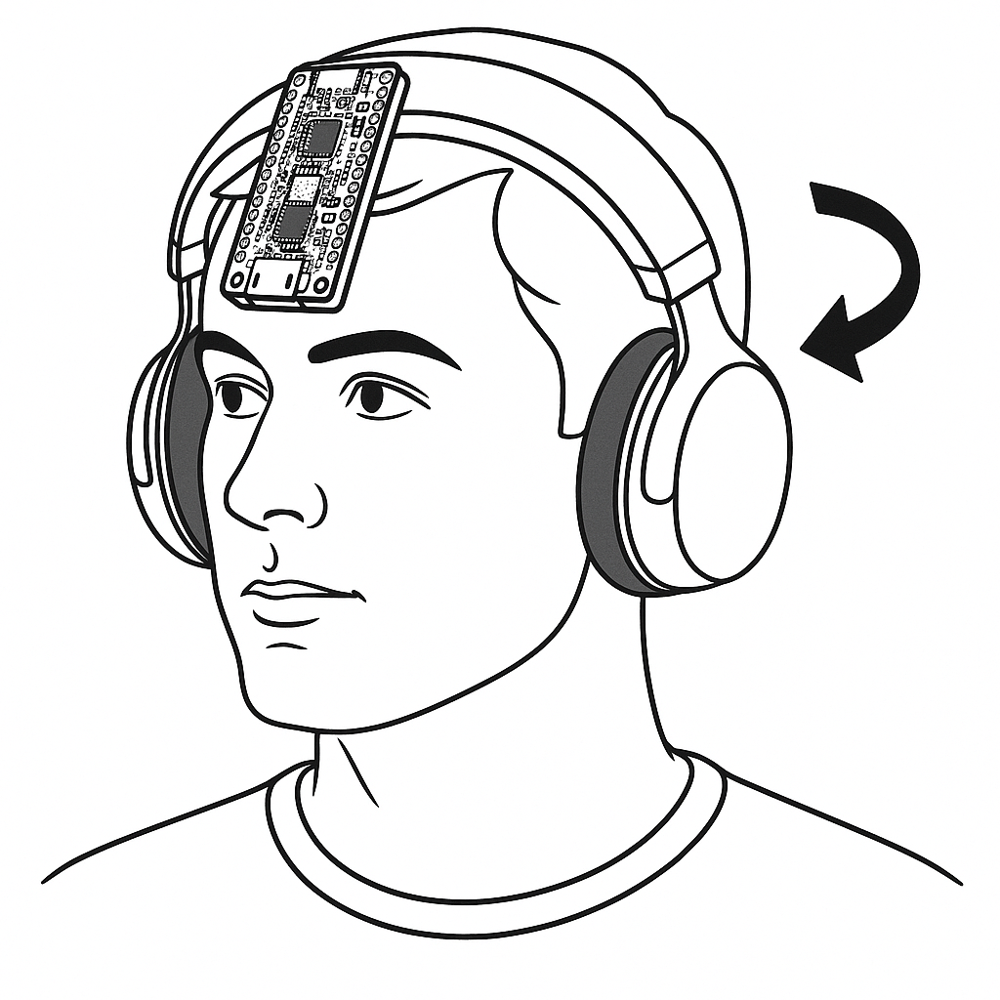

<h1>A Camera Platform Controller operated by Head Gestures, equipped with an ESP32-CAM</h1>

This project showcases a camera platform controller operated by head gestures. The gestures are detected by a Nano33 BLE and the camera platform is equipped with an ESP32-CAM. The Nano 33 BLE has been trained with head gestures to left and right using machine learning. The camera module captures live video and streams it through a custom socket server, which relays the feed to a Flask web application.

<h2>Hardware Requirements</h2>

UNO R4 WIFI
 
NANO33 BLE
 
2 Axis Servo Gimbal SG90 Bracket Micro Pan Tilt
 
ESP32Cam
 

<h2>Protocols & Communication</h2>

WebSocket
 
Bluetooth Low Energy

<h2>Web Application</h2>

Flask

<h2>Setup Instructions</h2>

1. Build 2 Axis Servo Camera Platform and connect pins on UNO R4 WIFI
2. Run websocket_server.py
 
3. Run flask application
 
4. Open CameraWebServer.ino, fill in your Wi-Fi and WebSocket configurations, and upload it to the ESP32-CAM
 
5. Upload Camera_Platform.ino to the UNO R4 WIFI
 
6. Upload NANO_Movement.ino to the NANO33 BLE
 
7. Mount the Nano 33 BLE as the main mount (for example, on headphones or glasses)
<h2>Demo</h2>

 

